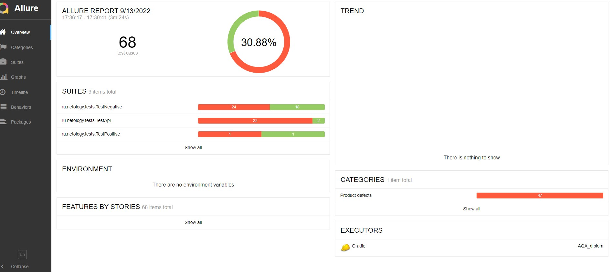

### Краткое описание
В период 30.08.22 - 09.09.22 было проведено автоматизированное тестирование веб-сервиса для приобретения тура
с онлайн-оплатой картой и оплатой в кредит по данным карты.

В соответствии с составленным планом автоматизации были разработаны автоматизированные тесты UI,
тесты записи данных в БД, тесты API.
### Тестовые данные:
В качестве тестовых данных использовались данные, предоставленные разработчиком (номера валидной и невалидной карт).
Другие входные данные генерировались автоматически с помощью вспомогательных библиотек для языка java.
### Тестовое окружение:
- Windows 11 Home
- Версия Java 11.0.14
- БД PostgreSQL 12.12
### Тестирование
Количество тест-кейсов: Общее количество тестов составило с 68, из них с позитивными сценариями 4, с негативными - 64. 
21 тест прошел успешно, что составляет 31% от общего количества.,
47 тестов завершились с отрицательным результатом - 69% от общего количества.

- Большое количество "упавших" API тестов связано с полным отсутствием валидации значений данных на backend. 
- Также отсутствует валидация вводимых значений в поле "владелец" формы, 
как для варианта покупка, так и для варианта "покупка в кредит"(8 "упавших" тестов). При этом форма с невалидными данными отправляется.
- Не корректно формируются сообщения под полями форм (14 "упавших" тестов).
- Есть несколько очень критичных багов - одобрение операции при невалидных данных. Описаны в Issues.
- По итогам сформирован отчет с использованием Allure Report.

Выявленные дефекты отражены в Issues.
#### Рекомендации:
- Устранить обнаруженные и описанные в Issues дефекты в соответствии с указанной критичностью.
Обратить особое внимание на валидацию полей при отправке формы, а также обработку API запросов на стороне backend.
- Добавить CSS селекторы в код веб-формы для возможности более надежного и стабильного автоматического тестирования.
- Разработать документацию на БД.
